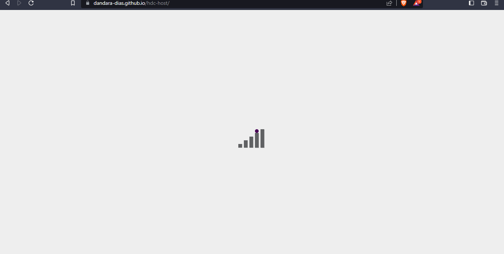

<h1 align="center">< hDC Host /></h1>

<p align="center">🗄️ Aplicação responsável pela página de hospedagem hDC Host 🗄️ Em construção 🚧</p>

<p align="center">
• <a href="#-sobre-o-projeto">Sobre</a> •
 <a href="#%EF%B8%8F-funcionalidades">Features</a> • 
 <a href="#-demonstra%C3%A7%C3%A3o">Demonstração</a> • 
 <a href="#-como-executar-o-projeto">Como executar</a> • 
 <a href="#-tecnologias">Tecnologias</a> •
 <a href="#%EF%B8%8F-autora">Autora</a> •
</p>

## 💻 Sobre o projeto

O hDC Host é um site informativo sobre uma empresa de hospedagens. Em uma página única e responsiva, foram utilizadas técnicas mais avançadas de HTML5 e CSS3, como flexbox, imagens com parallax e animações. Além disso, foi utilizado JavaScript para construir um cursor interativo e FontAwesome para incluir ícones. 

## ⚙️ Funcionalidades

- [x] O usuário pode encontrar na página:
  - [x] um header com opções de navegação e login
  - [x] seção com planos, preços e o que é oferecido
  - [x] buscador de domínios (apenas para exibição):

- [x] Ao utilizar os botões de login e selecionar:
  - [x] será redirecionado à página do projeto no GitHub, para mais detalhes

- [x] Ao utilizar o formulário de contato (apenas para exibição):
    - [x] é possível inserir nome, email e mensagem 

## 🎨 Demonstração

<p align="center">
  
</p>

## 🚀 Como executar o projeto

Este projeto possui apenas uma parte (Frontend), com as pastas:
1. CSS 
2. Arquivo index.html
3. Images

### Pré-requisitos

É bom ter um editor para trabalhar com o código, como o [VSCode](https://code.visualstudio.com/).

#### 🎲 Rodando a aplicação

``` bash
# Clone o repositório
$ git clone git@github.com:dandara-dias/hdc-host.git
# Entre na pasta do repositório que você acabou de clonar
$ cd hdc-host
# Com a extensão Live Server, clique em Go Live
# A aplicação iniciará na porta 5500 - acesse http://localhost:5500 
```
## 🛠 Tecnologias

As seguintes ferramentas foram usadas na construção do projeto:

#### **Website** ([HTML5](https://developer.mozilla.org/en-US/docs/Web/HTML) + [CSS3](https://developer.mozilla.org/pt-BR/docs/Web/CSS))

-   **[Loader](https://codepen.io/ispal/pen/mVaaJe)**
-   **[Cursor](https://tholman.com/cursor-effects/)**

#### **Utilitários**

-   Editor:  **[Visual Studio Code](https://code.visualstudio.com/)**  → Extensions:  **[Live Server](https://marketplace.visualstudio.com/items?itemName=ritwickdey.LiveServer)**
-   Markdown:  **[Rocketseat](https://blog.rocketseat.com.br/como-fazer-um-bom-readme/)**
-   Favicon:  **[Icons8](https://icons8.com.br/icon/111400/banco-de-dados)**
-   Paleta de cores: **[Coolors](https://coolors.co/palette/efefef-616163-e4572e-480355-0ead69)**
-   Fontes:  **[Caveat](https://fonts.google.com/specimen/Caveat?query=Caveat)**,  **[Work Sans](https://fonts.google.com/specimen/Work+Sans?query=Work+Sans)**, **[Righteous](https://fonts.google.com/specimen/Righteous?query=Righteous)**, **[Edu QLD Beginner](https://fonts.google.com/specimen/Edu+QLD+Beginner?query=Edu+QLD+Beginner)**, **[Amatic SC](https://fonts.google.com/specimen/Amatic+SC?query=Amatic+SC)**, **[Signika Negative](https://fonts.google.com/specimen/Signika+Negative?query=Signika+Negative)**, **[Ubuntu](https://fonts.google.com/specimen/Ubuntu?query=Ubuntu)**, **[Asul](https://fonts.google.com/specimen/Asul?query=Asul)**

## 🦸‍♀️ Autora

 
 <b>Dandara Dias</b> 🎀
 
[](https://www.linkedin.com/in/dandara-dias/) 
<a href = "mailto:dandaradias.contato@gmail.com"></a>
